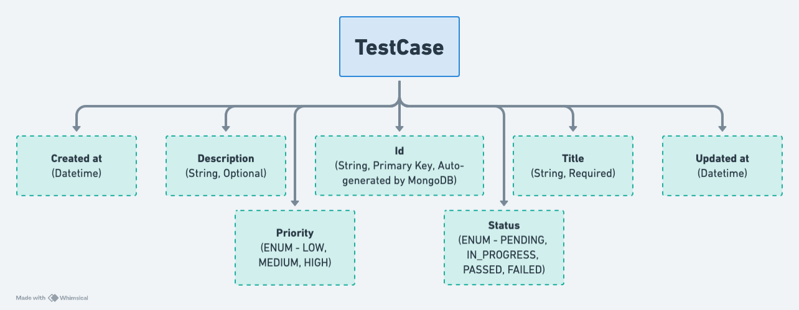

# Test Case Management System

The Test Case Management System is a Spring Boot application powered by MongoDB that allows users to manage software test cases. This project includes CRUD operations with filtering, pagination, validation, logging, testing, and Swagger API documentation.

## Features

- RESTful APIs with pagination and filtering.
- MongoDB for flexible NoSQL document storage.
- SLF4J Logging with Lombok integration.
- DTO Mapping using ModelMapper.
- Exception Handling with custom exceptions and a global handler.
- Unit & Integration Testing with JUnit 5 and Mockito.
- Swagger Documentation for API exploration.

## Setup Instructions

### Prerequisites

- Java 17 or higher (https://adoptium.net/)
- MongoDB Community Edition (or MongoDB Atlas)
- Maven (https://maven.apache.org/download.cgi)

### Clone the Repository
```bash
git clone https://github.com/YOUR_GITHUB_USERNAME/TestCaseManagementSystem.git
cd TestCaseManagementSystem
```

### Start MongoDB (Local)
```bash
mongod --dbpath /path/to/your/mongodb/data
```

### Run the Application
```bash
mvn spring-boot:run
```


The service will start at: http://localhost:8080

## API Endpoints

### Test Case Management Endpoints

| Method  | Endpoint                   | Description                                          |
|---------|----------------------------|------------------------------------------------------|
| GET     | /api/testcases             | Retrieve all test cases with filtering & pagination  |
| GET     | /api/testcases/{id}        | Retrieve a test case by ID                           |
| POST    | /api/testcases/create      | Create a new test case                               |
| PUT     | /api/testcases/{id}        | Update an existing test case                         |
| DELETE  | /api/testcases/{id}        | Delete a test case                                   |

#### Example Request (Create Test Case)

```json
{
  "title": "Login Test",
  "description": "Verify user login",
  "status": "PENDING",
  "priority": "HIGH"
}
```
### Example Response
```json
{
  "respCode": 201,
  "respMsg": "Test case created successfully",
  "respBody": {
    "id": "6600d4d2f8a7d",
    "title": "Login Test",
    "status": "PENDING",
    "priority": "HIGH",
    "createdAt": "2025-03-24T21:00:00",
    "updatedAt": "2025-03-24T21:00:00"
  }
}
```
### Schema


### Running Tests
To run all tests (unit and integration), execute:
```bash
mvn test
```

### Swagger UI
To access Swagger UI for APIs run the main file and go to this url in your web browser -
```bash
http://localhost:8080/swagger-ui/index.html
```
---

### Contributions
All credits go to @anujjainwork (Github profile)
---
